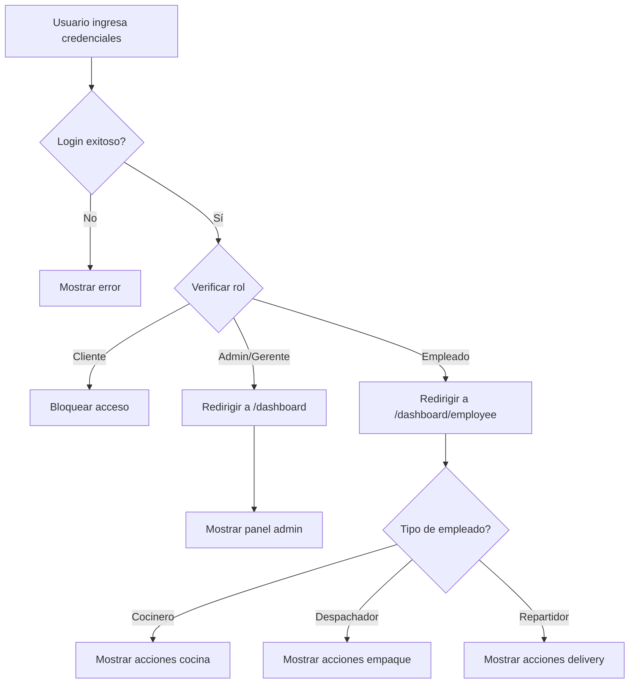

# Sistema de Roles y Permisos - 200 Millas

## 🎭 Roles Implementados

### 1. **Admin** 
- Acceso completo al sistema
- Dashboard: `/dashboard`
- Permisos:
  - ✅ Gestión de empleados (CRUD)
  - ✅ Gestión de productos (CRUD)
  - ✅ Ver analytics
  - ✅ Todas las funcionalidades

### 2. **Gerente**
- Gestión de local
- Dashboard: `/dashboard`
- Permisos:
  - ✅ Gestión de empleados (CRUD)
  - ✅ Gestión de productos (CRUD)
  - ✅ Ver analytics
  - ✅ Mismos permisos que Admin

### 3. **Cocinero**
- Operaciones de cocina
- Dashboard: `/dashboard/employee`
- Permisos:
  - ✅ Iniciar preparación de pedidos
  - ✅ Completar preparación de pedidos
  - ❌ No puede acceder a empaque
  - ❌ No puede acceder a delivery
  - ❌ No puede gestionar empleados/productos

### 4. **Despachador**
- Operaciones de empaque
- Dashboard: `/dashboard/employee`
- Permisos:
  - ✅ Completar empaquetado de pedidos
  - ❌ No puede acceder a cocina
  - ❌ No puede acceder a delivery
  - ❌ No puede gestionar empleados/productos

### 5. **Repartidor**
- Operaciones de delivery
- Dashboard: `/dashboard/employee`
- Permisos:
  - ✅ Iniciar delivery
  - ✅ Confirmar entrega
  - ❌ No puede acceder a cocina
  - ❌ No puede acceder a empaque
  - ❌ No puede gestionar empleados/productos

### 6. **Cliente** ❌
- **BLOQUEADO** en esta aplicación
- Los clientes no pueden acceder al panel de administración/empleados

## 🛣️ Sistema de Rutas

### Rutas Públicas
- `/login` - Página de inicio de sesión

### Rutas Protegidas - Admin/Gerente
```typescript
/dashboard              // Panel de administración
  - Gestión de empleados
  - Gestión de productos
  - Analytics
```

### Rutas Protegidas - Empleados
```typescript
/dashboard/employee     // Panel de empleado
  - Cocinero: Acciones de cocina
  - Despachador: Acciones de empaque
  - Repartidor: Acciones de delivery
```

### Rutas Protegidas - Todos
```typescript
/test-mocks            // Página de pruebas (desarrollo)
```

## 🔐 Implementación Técnica

### Componente RoleBasedRoute
```typescript
<RoleBasedRoute 
    allowedRoles={[ROLES.ADMIN, ROLES.GERENTE]} 
    redirectTo="/dashboard/employee"
>
    <Dashboard />
</RoleBasedRoute>
```

### Utilidades de Roles
```typescript
import { 
    isAdmin, 
    isGerente, 
    canAccessCocina,
    canAccessEmpaque,
    canAccessDelivery 
} from '@utils/roleUtils';

// Verificar permisos
if (canAccessCocina(userRole)) {
    // Mostrar acciones de cocina
}
```

## 🎨 UI Adaptativa por Rol

### Admin/Gerente Dashboard
- **Vista**: Panel completo con estadísticas
- **Secciones**:
  - 👥 Gestión de Empleados (contador)
  - 🍽️ Gestión de Productos (contador)
  - 📊 Analytics
  - Lista de empleados registrados

### Empleado Dashboard
- **Vista**: Panel de acciones específicas del rol
- **Cocinero**:
  - 🔥 Iniciar Preparación
  - ✅ Completar Preparación
- **Despachador**:
  - 📦 Completar Empaquetado
- **Repartidor**:
  - 🚚 Iniciar Delivery
  - ✅ Confirmar Entrega

## 🔄 Flujo de Autenticación



## 🧪 Testing por Rol

### Credenciales de Prueba

**Admin**
```
Correo: admin@200millas.com
Contraseña: admin123
Dashboard: /dashboard
```

**Gerente**
```
Correo: gerente@200millas.com
Contraseña: gerente123
Dashboard: /dashboard
```

**Cocinero**
```
Correo: cocinero@200millas.com
Contraseña: cocinero123
Dashboard: /dashboard/employee
Acciones: Cocina
```

**Repartidor**
```
Correo: repartidor@200millas.com
Contraseña: repartidor123
Dashboard: /dashboard/employee
Acciones: Delivery
```

**Despachador**
```
Correo: despachador@200millas.com
Contraseña: despachador123
Dashboard: /dashboard/employee
Acciones: Empaque
```

## 📋 Matriz de Permisos

| Acción | Admin | Gerente | Cocinero | Despachador | Repartidor |
|--------|-------|---------|----------|-------------|------------|
| Ver Dashboard Admin | ✅ | ✅ | ❌ | ❌ | ❌ |
| Gestionar Empleados | ✅ | ✅ | ❌ | ❌ | ❌ |
| Gestionar Productos | ✅ | ✅ | ❌ | ❌ | ❌ |
| Ver Analytics | ✅ | ✅ | ❌ | ❌ | ❌ |
| Iniciar Cocina | ❌ | ❌ | ✅ | ❌ | ❌ |
| Completar Cocina | ❌ | ❌ | ✅ | ❌ | ❌ |
| Completar Empaque | ❌ | ❌ | ❌ | ✅ | ❌ |
| Iniciar Delivery | ❌ | ❌ | ❌ | ❌ | ✅ |
| Completar Delivery | ❌ | ❌ | ❌ | ❌ | ✅ |

## 🚀 Características Implementadas

### ✅ Redirección Automática
- Login redirige automáticamente según el rol
- Admin/Gerente → `/dashboard`
- Empleados → `/dashboard/employee`

### ✅ Protección de Rutas
- Rutas protegidas por autenticación
- Rutas protegidas por rol específico
- Redirección automática si no tiene permisos

### ✅ UI Adaptativa
- Dashboard muestra solo acciones permitidas
- Botones deshabilitados si no tiene permisos
- Mensajes claros sobre permisos

### ✅ Validación de Roles
- Bloqueo de clientes
- Validación en backend (mocks)
- Validación en frontend (rutas)

## 🔧 Extensibilidad

Para agregar un nuevo rol:

1. **Agregar a ROLES**:
```typescript
// src/utils/roleUtils.ts
export const ROLES = {
    // ... existentes
    NUEVO_ROL: 'NuevoRol'
};
```

2. **Crear función de verificación**:
```typescript
export const isNuevoRol = (role?: string): boolean => {
    return role?.toLowerCase() === ROLES.NUEVO_ROL.toLowerCase();
};
```

3. **Agregar permisos**:
```typescript
export const canDoSomething = (role?: string): boolean => {
    return isNuevoRol(role) || isAdmin(role);
};
```

4. **Actualizar rutas** si es necesario

5. **Actualizar UI** para mostrar acciones específicas

---

**Fecha de implementación**: 2025-11-30  
**Estado**: ✅ Completado y verificado
