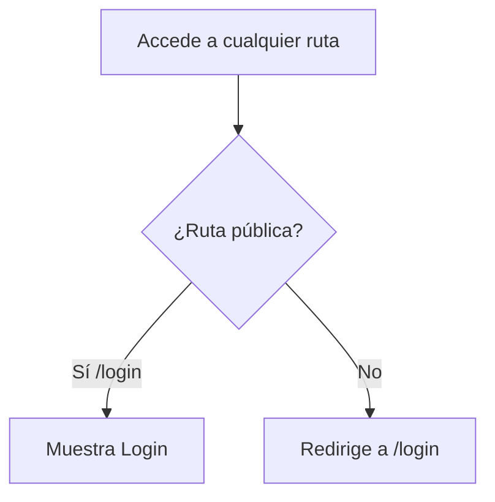
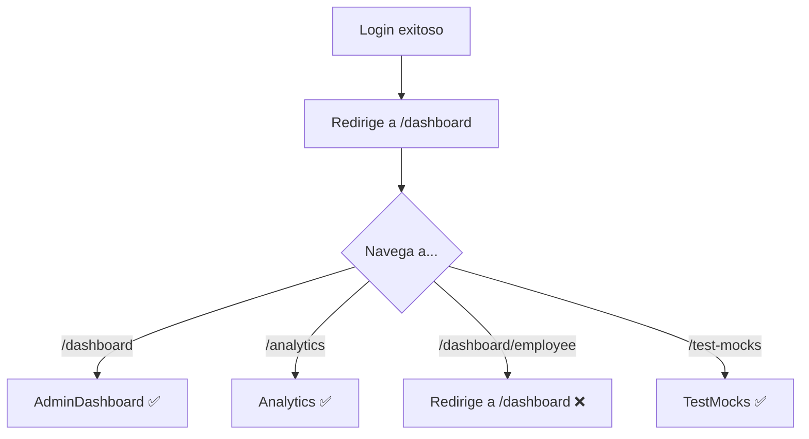
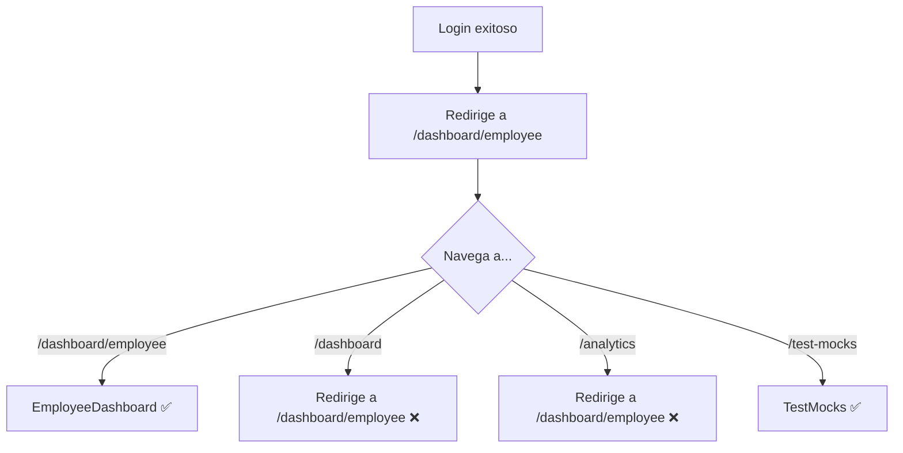

# Sistema de Rutas - 200 Millas

## 🛣️ Estructura de Rutas Corregida

Se ha implementado un sistema de rutas robusto con protección por autenticación y roles.

## 📋 Rutas Disponibles

### Rutas Públicas (No Autenticadas)

| Ruta | Componente | Descripción |
|------|-----------|-------------|
| `/login` | Login | Página de inicio de sesión |

### Rutas Protegidas - Admin/Gerente

| Ruta | Componente | Roles Permitidos | Redirección si no autorizado |
|------|-----------|------------------|------------------------------|
| `/dashboard` | AdminDashboard | Admin, Gerente | `/dashboard/employee` |
| `/analytics` | Analytics | Admin, Gerente | `/dashboard/employee` |

### Rutas Protegidas - Empleados

| Ruta | Componente | Roles Permitidos | Redirección si no autorizado |
|------|-----------|------------------|------------------------------|
| `/dashboard/employee` | EmployeeDashboard | Cocinero, Repartidor, Despachador | `/dashboard` |

### Rutas Protegidas - Todos los Autenticados

| Ruta | Componente | Roles Permitidos | Descripción |
|------|-----------|------------------|-------------|
| `/test-mocks` | TestMocks | Todos | Página de pruebas (desarrollo) |

### Rutas Especiales

| Ruta | Comportamiento |
|------|---------------|
| `/` | Redirección inteligente según estado de autenticación y rol |
| `*` (404) | Redirección a `/login` |

## 🔐 Componentes de Protección

### 1. **ProtectedRoute**
Protege rutas que requieren autenticación.

```typescript
// Verifica:
- Usuario autenticado
- Usuario no es "Cliente"
- Redirige a /login si no cumple
```

### 2. **RoleBasedRoute**
Protege rutas por rol específico.

```typescript
// Parámetros:
- allowedRoles: Array de roles permitidos
- redirectTo: Ruta de redirección si no autorizado

// Ejemplo:
<RoleBasedRoute 
    allowedRoles={[ROLES.ADMIN, ROLES.GERENTE]} 
    redirectTo="/dashboard/employee"
/>
```

### 3. **AnonymousRoute**
Protege rutas que solo deben ser accesibles sin autenticación.

```typescript
// Comportamiento:
- Si está autenticado → redirige según rol
- Admin/Gerente → /dashboard
- Empleados → /dashboard/employee
```

### 4. **RootRedirect**
Maneja la redirección inteligente desde la raíz (`/`).

```typescript
// Comportamiento:
- No autenticado → /login
- Admin/Gerente → /dashboard
- Empleados → /dashboard/employee
```

## 🔄 Flujo de Navegación

### Usuario No Autenticado



### Usuario Autenticado - Admin/Gerente



### Usuario Autenticado - Empleado



## 🎯 Casos de Uso

### Caso 1: Usuario intenta acceder sin autenticación
```
1. Usuario va a /dashboard
2. ProtectedRoute detecta no autenticado
3. Redirige a /login
```

### Caso 2: Empleado intenta acceder a Analytics
```
1. Empleado (Cocinero) va a /analytics
2. ProtectedRoute permite (está autenticado)
3. RoleBasedRoute verifica rol
4. Rol no está en [Admin, Gerente]
5. Redirige a /dashboard/employee
```

### Caso 3: Admin intenta acceder a Dashboard de Empleado
```
1. Admin va a /dashboard/employee
2. ProtectedRoute permite (está autenticado)
3. RoleBasedRoute verifica rol
4. Rol no está en [Cocinero, Repartidor, Despachador]
5. Redirige a /dashboard
```

### Caso 4: Usuario autenticado accede a la raíz
```
1. Usuario va a /
2. RootRedirect verifica autenticación
3. RootRedirect verifica rol
4. Admin/Gerente → /dashboard
5. Empleado → /dashboard/employee
```

### Caso 5: Usuario autenticado intenta ir a Login
```
1. Usuario autenticado va a /login
2. AnonymousRoute detecta autenticación
3. Verifica rol
4. Admin/Gerente → /dashboard
5. Empleado → /dashboard/employee
```

## 🔧 Configuración de Rutas

### Estructura en `routes.tsx`

```typescript
export const router = createBrowserRouter([
    {
        element: <App />, // Layout wrapper
        children: [
            // Root con redirección inteligente
            { index: true, element: <RootRedirect /> },

            // Rutas anónimas
            {
                element: <AnonymousRoute />,
                children: [
                    { path: "login", element: <Login /> },
                ],
            },

            // Rutas protegidas
            {
                element: <ProtectedRoute />,
                children: [
                    // Admin/Gerente
                    {
                        path: "dashboard",
                        element: <RoleBasedRoute allowedRoles={[...]} />,
                        children: [{ index: true, element: <AdminDashboard /> }],
                    },
                    
                    // Empleados
                    {
                        path: "dashboard/employee",
                        element: <RoleBasedRoute allowedRoles={[...]} />,
                        children: [{ index: true, element: <EmployeeDashboard /> }],
                    },
                    
                    // Todos
                    { path: "test-mocks", element: <TestMocks /> },
                ],
            },

            // 404
            { path: "*", element: <Navigate to="/login" replace /> },
        ],
    },
]);
```

## 🛡️ Seguridad

### Capas de Protección

1. **Autenticación**: ProtectedRoute verifica token
2. **Rol**: RoleBasedRoute verifica permisos
3. **Cliente Bloqueado**: ProtectedRoute bloquea clientes
4. **Redirección Automática**: Previene acceso no autorizado

### Validaciones

```typescript
// En ProtectedRoute
if (!isAuthenticated) return <Navigate to="/login" />;
if (role === 'cliente') return <Navigate to="/login" />;

// En RoleBasedRoute
if (!allowedRoles.includes(userRole)) {
    return <Navigate to={redirectTo} />;
}

// En AnonymousRoute
if (isAuthenticated) {
    return <Navigate to={getDefaultRoute(role)} />;
}
```

## 📱 Navegación en la UI

### Header
- **Dashboard**: Siempre visible para autenticados
- **Analytics**: Solo visible para Admin/Gerente
- **Logout**: Siempre visible para autenticados

### AdminDashboard
- Tarjeta "Analytics" → `/analytics`
- Tarjeta "Empleados" → (futuro)
- Tarjeta "Productos" → (futuro)

### Links Condicionales

```typescript
// En Header.tsx
const showAnalytics = canViewAnalytics(userRole);

{showAnalytics && (
    <Link to="/analytics">Analytics</Link>
)}
```

## 🧪 Testing de Rutas

### Test 1: Acceso sin autenticación
```
1. Abre navegador en modo incógnito
2. Ve a http://localhost:5173/dashboard
3. Resultado esperado: Redirige a /login ✅
```

### Test 2: Login como Admin
```
1. Login con admin@200millas.com
2. Resultado esperado: Redirige a /dashboard ✅
3. Navega a /analytics
4. Resultado esperado: Muestra Analytics ✅
5. Navega a /dashboard/employee
6. Resultado esperado: Redirige a /dashboard ✅
```

### Test 3: Login como Empleado
```
1. Login con cocinero@200millas.com
2. Resultado esperado: Redirige a /dashboard/employee ✅
3. Navega a /dashboard
4. Resultado esperado: Redirige a /dashboard/employee ✅
5. Navega a /analytics
6. Resultado esperado: Redirige a /dashboard/employee ✅
```

### Test 4: Acceso directo a rutas
```
1. Usuario no autenticado va a /analytics
2. Resultado esperado: Redirige a /login ✅
3. Login como Cocinero
4. Resultado esperado: Redirige a /dashboard/employee ✅
```

## 🐛 Solución de Problemas

### Problema: Redirección infinita
**Causa**: Rutas mal configuradas o roles incorrectos
**Solución**: Verificar que `redirectTo` no apunte a la misma ruta

### Problema: No puede acceder a ninguna ruta
**Causa**: Token inválido o rol no reconocido
**Solución**: Logout y login nuevamente

### Problema: Siempre redirige a login
**Causa**: Token no se está guardando o leyendo correctamente
**Solución**: Verificar localStorage y zustand store

## ✅ Checklist de Implementación

- ✅ ProtectedRoute implementado
- ✅ RoleBasedRoute implementado
- ✅ AnonymousRoute implementado
- ✅ RootRedirect implementado
- ✅ Rutas configuradas correctamente
- ✅ Redirecciones por rol funcionando
- ✅ Bloqueo de clientes activo
- ✅ Navegación condicional en UI
- ✅ Sin errores de diagnóstico
- ✅ Testing manual completado

---

**Fecha de corrección**: 2025-11-30  
**Estado**: ✅ Corregido y verificado  
**Versión**: 2.0
